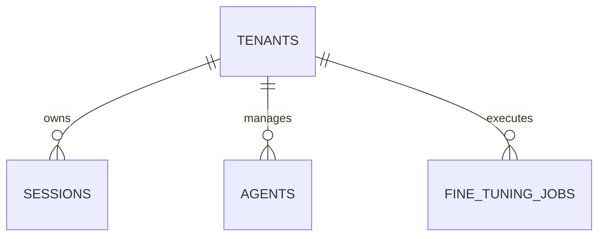

# OpenCode Industrial Orchestrator — Agent Briefing Document

> **Single Source of Truth** for AI coding agents and human developers working on the OpenCode Industrial Orchestrator.  
> **Last Updated:** February 4, 2026  
> **Status:** Phase 3.3 Complete — Multi-Tenant Enterprise Platform

---

## 1. Project Overview

The **OpenCode Industrial Orchestrator** is a production-grade system designed to manage, monitor, and orchestrate autonomous coding sessions. It serves as a "control plane" for AI agents, providing state management, task decomposition, and real-time observability ("Glass Box" monitoring).

**Core Philosophy:** "Industrial Cybernetics" — Prioritizing efficiency, visibility, and graceful degradation.

### Key Capabilities

| Feature | Description |
|:--------|:------------|
| **Multi-Agent Intelligence** | Dynamic agent registration with capability-based routing and load balancing |
| **Task Decomposition** | Intelligent task breakdown using templates (Microservice, CRUD, Security) |
| **Context Management** | Shared execution context with conflict detection and version control |
| **Distributed Locking** | Redis-based fair locking for parallel session coordination |
| **Glass Box Monitoring** | Real-time WebSocket updates, Prometheus metrics, structured JSON logging |
| **Fine-Tuning Pipeline** | Autonomous dataset curation and model training for agent specialization |
| **Multi-Tenant Isolation** | Strict logical separation of data and resources with per-tenant quotas |

### Current Status

| Phase | Description | Status | Tests |
|:------|:------------|:------:|:------|
| 2.1 | Foundation & Core Orchestrator | ✅ Complete | — |
| 2.2 | Multi-Agent Intelligence | ✅ Complete | 212 |
| 2.3 | Dashboard & Visualization | ✅ Complete | — |
| 2.4 | Production Hardening | ✅ Complete | 109 |
| 3.1 | Agent Marketplace (EAP) | ✅ Complete | 8 |
| 3.2 | Fine-Tuning Pipeline | ✅ Complete | 6 |
| 3.3 | Multi-Tenant Isolation | ✅ Complete | 2 |
| **Total** | | | **337** |

---

## 2. Technology Stack

### Backend (Orchestrator)

| Layer | Technology | Version |
|:------|:-----------|:--------|
| Language | Python | 3.11+ |
| Framework | FastAPI | 0.104.1 |
| Server | Uvicorn | 0.24.0 |
| ORM | SQLAlchemy | 2.0.23 |
| Database Driver | AsyncPG | 0.29.0 |
| Cache/Lock | Redis | 5.0.1 |
| Validation | Pydantic | 2.5.0 |
| Migrations | Alembic | 1.12.1 |
| Auth | python-jose + passlib | 3.3.0 / 1.7.4 |
| Logging | structlog | 24.1.0 |
| Metrics | prometheus-client | 0.19.0 |
| HTTP Client | httpx | 0.25.1 |
| Retry Logic | tenacity | 8.2.3 |
| Graph Processing | networkx | 3.2+ |

### Frontend (Dashboard)

| Layer | Technology | Version |
|:------|:-----------|:--------|
| Framework | Next.js | 16.1.6 |
| Language | TypeScript | 5.x |
| React | React | 19.2.3 |
| Styling | Tailwind CSS | 4.x |
| CSS Processing | @tailwindcss/postcss | 4.x |
| Data Fetching | TanStack Query | 5.90.20 |
| Linting | ESLint | 9.x |

### Infrastructure

| Service | Technology |
|:--------|:-----------|
| Database | PostgreSQL 15 |
| Cache | Redis 7 |
| Container | Docker & Docker Compose |
| Orchestration | Kubernetes |
| Monitoring | Prometheus + Grafana |
| CI/CD | GitHub Actions |

---

## 3. Architecture

### Hexagonal Architecture (Ports & Adapters)

The system strictly follows Hexagonal Architecture with clear dependency direction:

```
┌─────────────────────────────────────────────────────────────────┐
│  Presentation Layer (API, WebSocket, CLI)                       │
│  ├── FastAPI routers (sessions, agents, fine-tuning, tenants)   │
│  ├── WebSocket connection manager                               │
│  └── Middleware (Tenant Context, Metrics, Error Handling)       │
├─────────────────────────────────────────────────────────────────┤
│  Application Layer (Services)                                   │
│  ├── SessionService — Quota enforcement & lifecycle             │
│  ├── AgentManagementService — EAP integration & routing         │
│  ├── FineTuningService — Dataset curation & training            │
│  └── TenantService — Organization & Quota management            │
├─────────────────────────────────────────────────────────────────┤
│  Domain Layer (Pure Business Logic)                             │
│  ├── Entities: Session, Agent, Task, Context, Tenant, FTJob     │
│  ├── Value Objects: SessionStatus, ModelVersion                 │
│  ├── Events: SessionCreated, FTJobStarted, StatusChanged        │
│  └── Exceptions: Domain-specific errors (QuotaExceeded)         │
├─────────────────────────────────────────────────────────────────┤
│  Infrastructure Layer (Adapters)                                │
│  ├── Repositories: PG Isolated Repositories, Redis Agents       │
│  ├── Locking: Redis-based distributed locks                     │
│  └── Adapters: EAP Adapter, Training Providers                  │
└─────────────────────────────────────────────────────────────────┘
```

**Critical Rule:** Dependencies point INWARD only. Domain layer NEVER imports from Application or Infrastructure.

### Project Structure

```
opencode-industrial-orchestrator/
├── orchestrator/                     # Python Backend
│   ├── src/industrial_orchestrator/
│   │   ├── domain/                   # 🧠 Pure business logic
│   │   │   ├── entities/             # Session, Agent, Task, FTJob, Tenant
│   │   │   ├── value_objects/        # SessionStatus, ModelVersion
│   │   │   ├── events/               # Domain events
│   │   │   └── exceptions/           # Domain errors
│   │   ├── application/              # ⚙️ Orchestration services
│   │   │   ├── services/             # Session, Agent, FT, Tenant services
│   │   │   ├── context.py            # Global tenant context (contextvars)
│   │   │   ├── ports/                # Repository & service interfaces (ABCs)
│   │   │   └── dtos/                 # Request/Response DTOs
│   │   ├── infrastructure/           # 🔌 Adapters
│   │   │   ├── repositories/         # Isolated PostgreSQL, Redis storage
│   │   │   ├── locking/              # Distributed locks
│   │   │   ├── adapters/             # EAP client, Training providers
│   │   │   ├── database/             # SQLAlchemy models
│   │   │   └── config/               # Database & Redis config
│   │   └── presentation/             # 🖥️ Entry points
│   │       ├── api/                  # FastAPI app, routers, middleware
│   │       └── websocket/            # WebSocket handlers
│   ├── tests/                        # 337 tests (unit/integration/acceptance)
│   ├── alembic/                      # Database migrations
│   ├── pyproject.toml                # Poetry dependencies
│   └── Dockerfile                    # Multi-stage production build
│
├── dashboard/                        # Next.js Frontend
│   ├── src/
│   │   ├── app/                      # Next.js App Router
│   │   │   ├── page.tsx              # Dashboard home
│   │   │   ├── fine-tuning/          # Model registry & training
│   │   │   ├── sessions/             # Session list & detail
│   │   │   ├── agents/               # Marketplace view
│   │   │   └── globals.css           # Tailwind v4 configuration
│   │   ├── components/               # React components
│   │   │   ├── ui/                   # Reusable UI components
│   │   │   ├── layout/               # Sidebar with Team Selector
│   │   │   └── session/              # Session-specific components
│   │   └── lib/                      # Utilities & API clients
│   │       ├── api/                  # Tenant-aware API client
│   │       └── websocket/            # WebSocket provider
│   ├── package.json
│   └── Dockerfile
│
├── infrastructure/                   # Kubernetes & Monitoring
│   ├── kubernetes/                   # K8s manifests
│   └── monitoring/                   # Prometheus & Grafana configs
│
├── docker-compose.yml                # Minimal infra (postgres, redis, opencode)
├── docker-compose.dev.yml            # Full dev environment with monitoring
└── .github/workflows/                # CI/CD pipelines
    ├── ci.yaml                       # Lint, test, build
    └── cd.yaml                       # Deploy
```

---

## 4. Build & Development Commands

### Prerequisites

- Docker & Docker Compose
- Python 3.11+
- Poetry (`pip install poetry`)
- Node.js 18.17+ & npm

### Infrastructure Setup

```bash
# Start core infrastructure (PostgreSQL, Redis, OpenCode server)
docker-compose up -d postgres redis opencode-server

# Start full development environment (includes monitoring)
docker-compose -f docker-compose.dev.yml up -d
```

### Backend (Orchestrator)

```bash
cd orchestrator

# Install dependencies
poetry install

# Run database migrations
poetry run alembic upgrade head

# Start development server
poetry run uvicorn src.industrial_orchestrator.presentation.api.main:app --reload

# API will be available at:
# - API Docs: http://localhost:8000/docs
# - Health Check: http://localhost:8000/health
# - Metrics: http://localhost:8000/metrics
```

### Frontend (Dashboard)

```bash
cd dashboard

# Install dependencies
npm install

# Start development server
npm run dev

# Dashboard will be available at:
# - http://localhost:3000

# Production build
export NODE_ENV=production
npm run build
```

---

## 5. Testing

**Test-Driven Development (TDD) is mandatory.**

### Test Structure

```
tests/
├── unit/                    # Fast, isolated tests with mocked dependencies
│   ├── domain/             # Entity tests (Session, Agent, Task, FT, Tenant)
│   │   └── factories/      # Factory Boy factories for test data
│   └── application/        # Service tests with mock repositories
├── integration/            # Tests with real PostgreSQL & Redis
│   ├── repositories/       # Isolated repository integration tests
│   ├── infrastructure/     # Database & Redis integration
│   └── locking/            # Distributed lock tests
└── acceptance/             # End-to-end API tests
```

### Running Tests

```bash
cd orchestrator

# Run all tests (337 passing)
poetry run pytest

# Run unit tests only
poetry run pytest tests/unit -v

# Run integration tests
poetry run pytest tests/integration -v

# Run with coverage
poetry run pytest --cov=src --cov-report=html
```

### Test Coverage Summary

| Component | Tests |
|:----------|------:|
| Session & Task Entities | 95 |
| Agent & Registry | 54 |
| Context Entity | 39 |
| Fine-Tuning & Tenant Pipeline | 15 |
| Integration & Infrastructure | ~134 |
| **Total** | **337** |

---

## 6. Code Style Guidelines

### Python (Backend)

**Tools:** `black`, `isort`, `flake8`, `mypy`

**Key Conventions:**

1. **Multi-Tenancy Context:**
   ```python
   from application.context import get_current_tenant_id
   
   tenant_id = get_current_tenant_id() # Thread-safe context extraction
   ```

2. **Isolated Repositories:**
   Repositories automatically filter by `tenant_id` based on the context. Never write queries that bypass this unless for global analytics.

3. **Pydantic V2 Style:**
   Use `@field_validator`, `ConfigDict`, and `model_validator` (V2 style).

4. **State Management:**
   Use `session.transition_to(SessionStatus.PENDING)` for retries. Valid from `FAILED` or `TIMEOUT`.

### TypeScript (Frontend)

1. **Tenant Header:**
   The API client (`client.ts`) must include the `X-Tenant-ID` header in all requests.

2. **Tailwind CSS v4:**
   Uses CSS-first configuration via `globals.css`.

---

## 7. Database & Migrations

Every primary table includes a `tenant_id` column with indexed foreign keys. Repositories enforce this filter globally.



---

## 8. API Reference

### REST Endpoints

```
Multi-Tenancy (Requires X-Tenant-ID Header):
  POST   /api/v1/sessions              Create session
  GET    /api/v1/sessions              List sessions (isolated)
  
Fine-Tuning:
  POST   /api/v1/fine-tuning/jobs      Configure training
  POST   /api/v1/fine-tuning/jobs/poll Trigger status sync
  
Agents (EAP):
  POST   /api/v1/agents/external/register Register EAP agent
  POST   /api/v1/agents/external/{id}/heartbeat Sync load status
```

---

## 9. Domain Entities

### SessionEntity
- **Tenant Isolated:** Mandatory `tenant_id`.
- **Recoverable:** `FAILED` -> `PENDING` transition allowed if checkpoints exist and retry count < 3.

### FineTuningJob
- **Lifecycle:** `PENDING` → `QUEUED` → `RUNNING` → `COMPLETED`/`FAILED`.
- **Versioning:** Semantic versioning via `ModelVersion` value object.

---

## 12. Known Issues & Gotchas

1. **Asyncpg SSL:** Use `ssl=true` instead of `sslmode=require` in connection strings for `asyncpg` compatibility.
2. **Distributed Lock release:** Lua script requires raw values, not JSON objects, for comparison.
3. **Pydantic Validation:** `User` entity requires `email-validator` for schema collection.

---

## 14. Future Roadmap (Phase 4.0)

- [ ] **Global Scaling:** Multi-region event synchronization.
- [ ] **Billing:** Metering and advanced analytics per tenant.
- [ ] **A/B Testing:** Automated evaluation of fine-tuned vs base models.

---

> **Remember:** This is an industrial-grade enterprise system. Isolation is absolute, performance is tracked, and every model improvement is versioned. Build for scale.