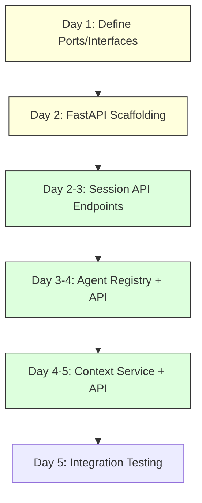

# OpenCode Industrial Orchestrator — Codebase Validation Report

> **Date**: 2026-02-03 | **Objective**: Deep understanding and validation of project documentation against actual codebase

## Executive Summary

I have meticulously reviewed all four specified documents and validated them against the actual codebase. The project is a **production-grade autonomous coding session orchestrator** built on **Hexagonal Architecture** principles. The core foundation (Phase 2.1) is **complete and solid**, while Phase 2.2 (Multi-Agent Intelligence) is **partially implemented**.

> [!IMPORTANT]
> The execution plan in `execution-remaining.md` is **valid but requires refinement** — some tasks are partially complete, and the API layer implementation is a critical bottleneck.

---

## 1. Project Philosophy Validation

### What
An industrial-grade system to manage and orchestrate autonomous coding sessions with:
- Resilient state management (99.9% persistence)
- Multi-agent intelligence with capability-based routing
- Distributed coordination with fair locking
- "Glass Box" monitoring for transparency

### Why
Traditional agent frameworks lack the industrial standards required for production environments:
- No proper session lifecycle management
- No distributed coordination primitives
- No task decomposition capabilities
- No comprehensive observability

### How
**Hexagonal Architecture** (Ports & Adapters) ensuring:
- Domain isolation (pure business logic, no external dependencies)
- High testability (TDD mandatory)
- Infrastructure resilience (circuit breakers, retry logic)

---

## 2. Codebase Structure Validation

### ✅ Directory Structure — **CONFIRMED ALIGNED**

```text
orchestrator/src/industrial_orchestrator/
├── domain/                    ✅ Pure business logic
│   ├── entities/              ✅ session.py, agent.py, task.py, base.py
│   ├── value_objects/         ✅ session_status.py, execution_metrics.py
│   ├── events/                ✅ session_events.py
│   └── exceptions/            ✅ 5 exception modules
├── application/               ✅ Orchestration logic
│   ├── services/              ✅ session_service.py, task_decomposition_service.py
│   ├── ports/                 ⚠️  Empty (interfaces not extracted yet)
│   ├── dtos/                  ⚠️  Empty
│   └── use_cases/             ⚠️  Empty
├── infrastructure/            ✅ Adapters & IO
│   ├── database/              ✅ models.py (927 lines)
│   ├── repositories/          ✅ session_repository.py, base.py
│   ├── locking/               ✅ distributed_lock.py (891 lines)
│   ├── adapters/              ✅ opencode_client.py
│   ├── config/                ✅ database.py, redis.py
│   └── exceptions/            ✅ opencode_exceptions.py, redis_exceptions.py
└── presentation/              ⚠️  Scaffolded but EMPTY
    ├── api/                   ❌ No files
    ├── cli/                   ❌ No files
    └── rpc/                   ❌ No files
```

### Component Size Analysis

| Component | Lines | Methods | Status |
|:----------|------:|--------:|:-------|
| `SessionEntity` | 245 | 16 | ✅ Complete (state machine, validation) |
| `AgentEntity` | 767 | 31 | ✅ Complete (capability/load management) |
| `TaskEntity` | 723 | 38 | ✅ Complete (decomposition, DAG) |
| `SessionService` | 638 | 19 | ✅ Complete (lifecycle management) |
| `TaskDecompositionService` | 684 | 22 | ✅ Complete (templates, heuristics) |
| `SessionRepository` | 786 | 22 | ✅ Complete (Unit of Work, caching) |
| `IndustrialDistributedLock` | 891 | 43 | ✅ Complete (fair queue, heartbeat, deadlock detection) |
| `DatabaseModels` | 927 | 24 | ✅ Complete (Session, Metrics, Checkpoint) |

---

## 3. Phase Completion Status

### ✅ Phase 2.1: Foundation & Core Orchestrator — **COMPLETE**

| Deliverable | Status | Evidence |
|:------------|:------:|:---------|
| Domain Layer implementation | ✅ | `SessionEntity`, `SessionStatus`, `ExecutionMetrics` |
| PostgreSQL with Alembic | ✅ | `models.py` + migration in `versions/` |
| Redis distributed locking | ✅ | `distributed_lock.py` with fair queuing |
| OpenCode client adapter | ✅ | `opencode_client.py` |
| Session Repository (UoW) | ✅ | `session_repository.py` |
| Session Service | ✅ | `session_service.py` |
| TDD workflow | ✅ | 6 test files (unit + integration) |

### 🔄 Phase 2.2: Multi-Agent Intelligence — **PARTIALLY COMPLETE**

| Deliverable | Status | Evidence |
|:------------|:------:|:---------|
| AgentEntity (specialization) | ✅ | `agent.py` - 767 lines with capabilities/performance |
| TaskEntity (decomposition) | ✅ | `task.py` - 723 lines with DAG management |
| TaskDecompositionService | ✅ | `task_decomposition_service.py` - templates + heuristics |
| Agent Registry port/interface | ❌ | Not implemented |
| RedisAgentRegistry adapter | ❌ | Not implemented |
| AgentManagementService | ❌ | Not implemented |
| ContextEntity & ContextScope | ❌ | Not implemented |
| ContextService | ❌ | Not implemented |
| FastAPI routers (sessions/agents/tasks) | ❌ | `presentation/api/` is empty |

### 🔲 Phase 2.3: Dashboard — **NOT STARTED**

| Deliverable | Status | Evidence |
|:------------|:------:|:---------|
| Next.js project | ❌ | `dashboard/` directory is empty |
| WebSocket endpoints | ❌ | No WebSocket code in backend |
| UI components | ❌ | Nothing exists |

### 🔲 Phase 2.4: Production Hardening — **NOT STARTED**

| Deliverable | Status | Evidence |
|:------------|:------:|:---------|
| Optimized Dockerfile | ⚠️ | `Dockerfile.dev` exists, no production build |
| Kubernetes manifests | ❌ | None |
| Prometheus instrumentation | ❌ | None |
| CI/CD pipelines | ❌ | None |

---

## 4. Test Coverage Analysis

### Existing Tests — **6 files identified**

| Test File | Purpose |
|:----------|:--------|
| `unit/domain/test_session_entity.py` | Domain entity validation |
| `unit/domain/factories/session_factory.py` | Factory Boy data generation |
| `integration/infrastructure/test_database_integration.py` | DB connection & queries |
| `integration/infrastructure/test_redis_integration.py` | Redis operations |
| `integration/locking/test_distributed_lock_integration.py` | Lock acquisition & fairness |
| `integration/repositories/test_session_repository_integration.py` | Repository CRUD |

### Missing Tests
- Agent entity tests
- Task entity tests
- TaskDecompositionService tests
- SessionService tests

---

## 5. Execution Plan Validation (`execution-remaining.md`)

### Week 2 — Status Review

| Task | Documented Status | Actual Status | Gap Analysis |
|:-----|:-----------------|:--------------|:-------------|
| Agent Registry (Domain) | Not started | ❌ Missing | Port interface not defined |
| RedisAgentRegistry | Not started | ❌ Missing | No adapter implementation |
| AgentManagementService | Not started | ❌ Missing | No service file exists |
| ContextEntity/ContextScope | Not started | ❌ Missing | No domain definitions |
| Context storage adapter | Not started | ❌ Missing | No infrastructure code |
| ContextService | Not started | ❌ Missing | No service file |
| FastAPI routers | Not started | ❌ Missing | `/api/` directory empty |
| API main.py entry point | Not started | ❌ Missing | No entry point |

> [!WARNING]
> **The execution plan lists Week 2 Day 5 as "API Layer Implementation" but this is a BLOCKER** — without FastAPI endpoints, no functionality is exposed externally. This should be **prioritized earlier**.

### Recommended Revised Execution Order



---

## 6. Documentation Consistency

| Document | Consistency | Notes |
|:---------|:-----------:|:------|
| `GEMINI.md` | ✅ | Accurate status (Phase 2.2 in progress) |
| `README.md` | ✅ | Correct architecture diagrams |
| `Project_Architecture_Document.md` | ✅ | File hierarchy matches codebase |
| `orignal-draft-planning.md` | ⚠️ | Draft for dashboard UI, not yet implemented |
| `status.md` | ⚠️ | States Phase 2.1 complete (accurate) but out of date on 2.2 |
| `execution-remaining.md` | ⚠️ | Valid but API prioritization needs adjustment |

---

## 7. Key Recommendations

### Immediate Actions (Priority 1)

1. **Implement FastAPI entry point** (`presentation/api/main.py`)
   - Create basic health check endpoint
   - Set up middleware (CORS, error handling)
   - Configure structured logging

2. **Create Session API Router** (`presentation/api/routers/sessions.py`)
   - Expose `SessionService` methods via REST
   - Add Pydantic DTOs for request/response

3. **Define Port Interfaces** (`application/ports/`)
   - `SessionRepositoryPort` (abstract interface)
   - `AgentRegistryPort` (abstract interface)
   - `ContextRepositoryPort` (abstract interface)

### Short-Term Actions (Priority 2)

4. **Implement Agent Registry**
   - Domain: `AgentRegistry` interface
   - Infrastructure: `RedisAgentRegistry` adapter
   - Application: `AgentManagementService`

5. **Add Missing Tests**
   - Agent entity unit tests
   - Task entity unit tests
   - Service-level tests

### Medium-Term Actions (Priority 3)

6. **Context Management System**
   - Define `ContextEntity` and `ContextScope`
   - Implement storage (Redis or S3/MinIO)
   - Create `ContextService`

---

## 8. Dependencies & Tech Stack Validation

### `pyproject.toml` — **CONFIRMED ALIGNED**

| Dependency | Version | Purpose |
|:-----------|:--------|:--------|
| Python | 3.11+ | ✅ Modern async features |
| FastAPI | 0.104.1 | ✅ Async API framework |
| SQLAlchemy | 2.0.23 | ✅ Async ORM |
| Redis | 5.0.1 | ✅ Distributed locking |
| Pydantic | 2.5.0 | ✅ Validation |
| Tenacity | 8.2.3 | ✅ Retry logic |
| Pytest | 7.4.3 | ✅ Testing |
| Factory Boy | 3.3.0 | ✅ Test data generation |

> [!TIP]
> All dependencies are production-ready with async support. No networkx dependency is declared in `pyproject.toml` but it's imported in `task.py` — this needs to be added.

---

## Conclusion

The **OpenCode Industrial Orchestrator** has a **solid architectural foundation** with industrial-grade patterns correctly implemented in the Domain and Infrastructure layers. The primary gap is the **incomplete Application/Presentation layer wiring** — the business logic exists but is not yet exposed via API.

The execution plan is valid but would benefit from **front-loading the API scaffolding** to enable incremental testing and integration earlier in the development cycle.
