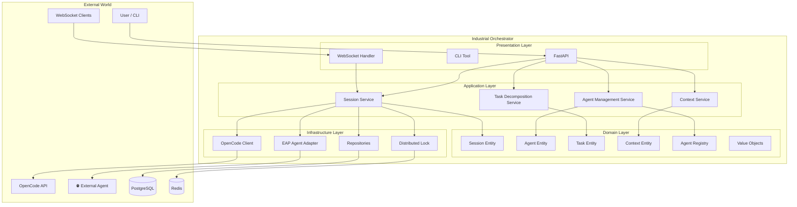
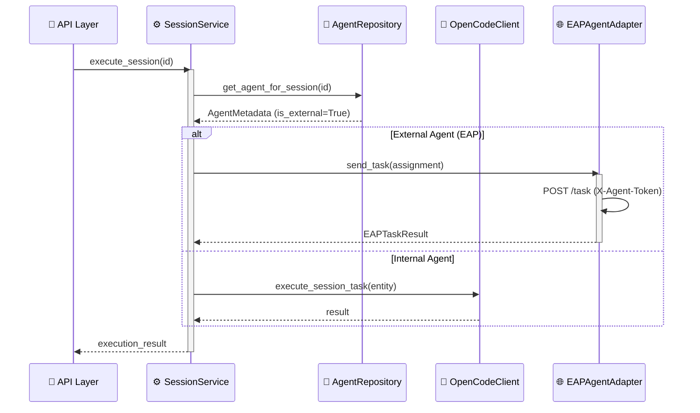
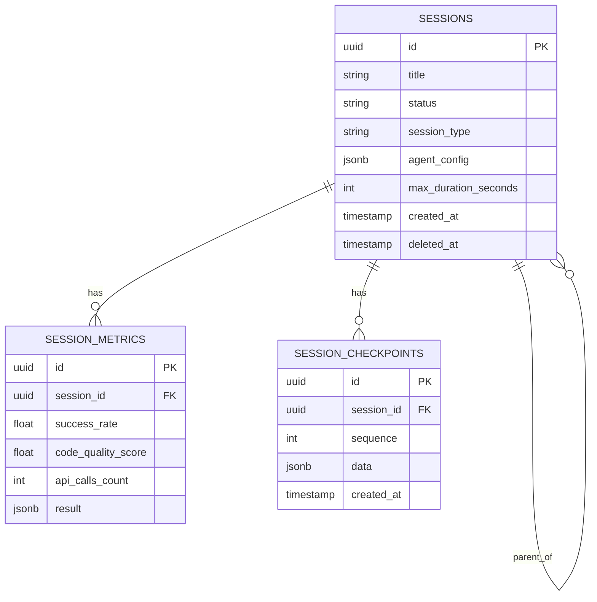

# OpenCode Industrial Orchestrator

> **"Industrial Cybernetics"** — A utilitarian, transparent orchestration interface prioritizing ruthless efficiency, visibility ("Glass Box"), and graceful degradation.

This document serves as the **Single Source of Truth** for the architecture, design, and implementation of the OpenCode Industrial Orchestrator. It is intended to guide new developers and agents in understanding the system and contributing effectively.

## 1. Executive Summary

The **OpenCode Industrial Orchestrator** is a production-grade system designed to manage, monitor, and orchestrate autonomous coding sessions. Unlike generic agent frameworks, this system is built on **Hexagonal Architecture (Ports & Adapters)** principles to ensure strict domain isolation, high testability, and infrastructure resilience.

### Core Objectives
*   **Resilient State Management:** 99.9% session persistence through server restarts.
*   **Multi-Agent Intelligence:** Capability-based routing and task decomposition.
*   **Distributed Coordination:** Fair locking and deadlock prevention for parallel execution.
*   **Glass Box Monitoring:** Comprehensive metrics for every transition and operation.

### Current Implementation Status


| Phase | Description | Status |

|:------|:------------|:------:|

| 2.1 | Foundation & Core Orchestrator | ✅ Complete |

| 2.2 | Multi-Agent Intelligence | ✅ Complete |

| 2.3 | Dashboard & Visualization | ✅ Complete |

| 2.4 | Production Hardening | ✅ Complete |

| 3.1 | Agent Marketplace & EAP | ✅ Complete |


---


## 2. System Architecture


The system follows a strict **Hexagonal Architecture**, separating the core business logic from the outside world.





### Application Logic Flow (Execution Dispatch)





### Database Schema





---


## 3. File Hierarchy & Key Components


```text

orchestrator/src/industrial_orchestrator/

├── domain/                               # 🧠 PURE BUSINESS LOGIC (No external deps)

│   ├── entities/

│   │   ├── agent.py                      # Agent specialization & load balancing

│   │   ├── context.py                    # Context sharing & conflict detection

│   │   ├── registry.py                   # Agent registry & capability indexing

│   │   ├── session.py                    # Core session state machine

│   │   ├── task.py                       # Task decomposition & dependencies

│   │   └── base.py                       # Base entity class

│   ├── value_objects/                    # Immutable domain values

│   │   ├── session_status.py             # Status enums & transition logic

│   │   └── execution_metrics.py          # Performance telemetry

│   ├── events/                           # Domain events

│   │   └── session_events.py             # Session lifecycle events

│   └── exceptions/                       # Domain-specific errors

│       ├── agent_exceptions.py

│       ├── context_exceptions.py

│       ├── locking_exceptions.py

│       ├── repository_exceptions.py

│       ├── session_exceptions.py

│       └── task_exceptions.py

│

├── application/                          # ⚙️ ORCHESTRATION LOGIC

│   ├── services/

│   │   ├── session_service.py            # Lifecycle & execution dispatch

│   │   ├── agent_management_service.py   # Agent registration & EAP handshake

│   │   ├── context_service.py            # Context creation & sharing

│   │   └── task_decomposition_service.py # Intelligent task breakdown

│   ├── ports/                            # Interfaces (Abstract Base Classes)

│   │   ├── repository_ports.py           # Repository ABCs

│   │   └── service_ports.py              # ExternalAgentPort (EAP contract)

│   ├── dtos/                             # Data Transfer Objects

│   │   ├── session_dtos.py

│   │   ├── agent_dtos.py

│   │   ├── task_dtos.py

│   │   └── external_agent_protocol.py    # EAP standard models

│   └── use_cases/                        # Specific application use cases

│

├── infrastructure/                       # 🔌 ADAPTERS & IO

│   ├── database/

│   │   └── models.py                     # SQLAlchemy models & triggers

│   ├── repositories/

│   │   ├── base.py                       # Generic repository with Unit of Work

│   │   ├── session_repository.py         # Session-specific data access

│   │   ├── agent_repository.py           # Redis-backed agent storage

│   │   └── context_repository.py         # Hybrid Redis/PostgreSQL context storage

│   ├── locking/

│   │   └── distributed_lock.py           # Redis-based fair locking

│   ├── adapters/

│   │   ├── opencode_client.py            # OpenCode API client

│   │   └── eap_agent_adapter.py          # HTTP-based EAP agent client

│   ├── config/                           # Configuration management

│   │   ├── database.py                   # DB connection pooling

│   │   └── redis.py                      # Redis client config

│   └── exceptions/                       # Infrastructure errors

│       ├── opencode_exceptions.py

│       └── redis_exceptions.py

│

└── presentation/                         # 🖥️ ENTRY POINTS

    ├── api/                              # FastAPI routes

    │   ├── main.py                       # Application factory

    │   ├── dependencies.py               # Dependency injection

    │   ├── middleware/                   # Request/Error handling

    │   └── routers/

    │       ├── sessions.py               # /api/v1/sessions

    │       ├── agents.py                 # Internal agents

    │       ├── external_agents.py        # /api/v1/agents/external (EAP)

    │       ├── tasks.py                  # /api/v1/tasks

    │       └── contexts.py               # /api/v1/contexts

    ├── websocket/                        # Real-time updates

    │   ├── connection_manager.py         # WebSocket connection pool

    │   └── session_events.py             # Session event broadcasting

    ├── cli/                              # CLI commands

    └── dashboard/                        # Next.js 16 Frontend (Marketplace)

```


---


## 4. API Reference


### REST Endpoints


| Endpoint | Method | Description |

|:---------|:------:|:------------|

| `/api/v1/sessions` | GET | List sessions with filtering |

| `/api/v1/sessions` | POST | Create new session |

| `/api/v1/sessions/{id}/start` | POST | Start session execution |

| `/api/v1/agents` | GET | List registered agents |

| `/api/v1/agents/external/register` | POST | Register external agent (EAP) |

| `/api/v1/agents/external/{id}/heartbeat` | POST | Agent heartbeat & load report |

| `/api/v1/agents/route` | POST | Route task to best agent |

| `/api/v1/tasks` | POST | Create new task |

| `/api/v1/tasks/{id}/decompose` | POST | Decompose task into subtasks |

| `/api/v1/contexts` | POST | Create execution context |

| `/health` | GET | Health check |


### WebSocket Endpoints


| Endpoint | Description |

|:---------|:------------|

| `/ws/sessions` | Subscribe to all session events |

| `/ws/sessions/{id}` | Subscribe to specific session events |


---


## 5. Development Workflow


### Standards

*   **Code Style:** Strict adherence to `black`, `isort`, and `flake8`.

*   **Testing:** **TDD (Test-Driven Development)** is mandatory.

    *   Unit Tests: `tests/unit` (Fast, mocked deps)

    *   Integration Tests: `tests/integration` (Real DB/Redis)

*   **Database:** Alembic for all schema changes. **Never** modify the schema manually.


### Key Commands

```bash

# Run all tests (329 tests)

poetry run pytest


# Run unit tests only

poetry run pytest tests/unit


# Run migrations

poetry run alembic upgrade head


# Start development server

poetry run uvicorn src.industrial_orchestrator.presentation.api.main:app --reload


# Start dashboard

cd dashboard && npm run dev

```


---


## 6. Test Coverage


| Component | Tests | Status |

|:----------|------:|:------:|

| Session Entity | 42 | ✅ |

| Agent Entity | 54 | ✅ |

| Task Entity | 53 | ✅ |

| Context Entity | 39 | ✅ |

| Task Decomposition Service | 24 | ✅ |

| Integration & Infrastructure | ~117 | ✅ |

| **Total** | **329** | ✅ |


---


## 7. Roadmap


### ✅ Phase 3.1: Agent Marketplace & EAP (Complete)

- External Agent Protocol (EAP) v1.0 specification

- Secure token-based registration handshake

- Outbound task dispatch via `EAPAgentAdapter`

- Marketplace UI for browsing and unit diagnostics

- 329 passing backend tests


### 🗓️ Phase 3.2: LLM Fine-Tuning Pipeline (Next)

- Automated dataset curator for session logs

- LoRA/QLoRA async training jobs

- Model versioning registry

- Integration with external training compute providers
