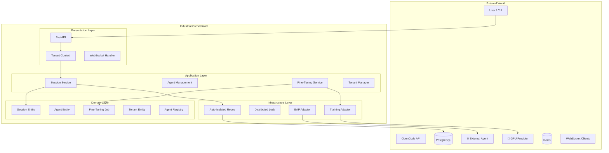
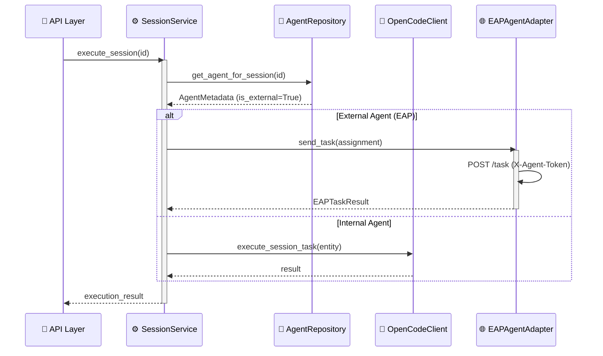
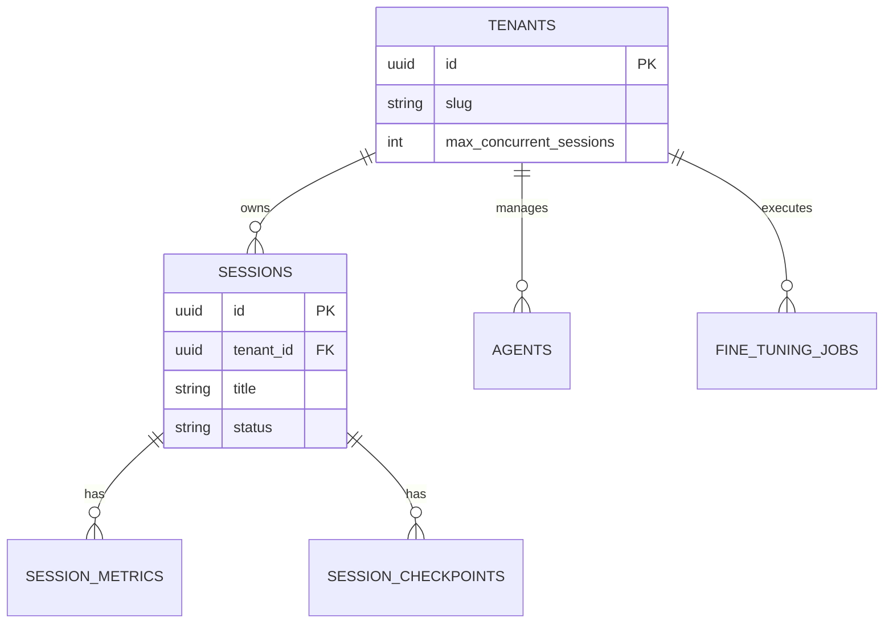

# OpenCode Industrial Orchestrator

> **"Industrial Cybernetics"** — A utilitarian, transparent orchestration interface prioritizing ruthless efficiency, visibility ("Glass Box"), and graceful degradation.

This document serves as the **Single Source of Truth** for the architecture, design, and implementation of the OpenCode Industrial Orchestrator. It is intended to guide new developers and agents in understanding the system and contributing effectively.

## 1. Executive Summary

The **OpenCode Industrial Orchestrator** is a production-grade system designed to manage, monitor, and orchestrate autonomous coding sessions. Unlike generic agent frameworks, this system is built on **Hexagonal Architecture (Ports & Adapters)** principles to ensure strict domain isolation, high testability, and infrastructure resilience.

### Core Objectives
*   **Resilient State Management:** 99.9% session persistence through server restarts.
*   **Multi-Agent Intelligence:** Capability-based routing and task decomposition.
*   **Distributed Coordination:** Fair locking and deadlock prevention for parallel execution.
*   **Glass Box Monitoring:** Comprehensive metrics for every transition and operation.
*   **Enterprise Multi-Tenancy**: Strict logical isolation and resource quotas per team.

### Current Implementation Status

| Phase | Description | Status |
|:------|:------------|:------:|
| 2.1 | Foundation & Core Orchestrator | ✅ Complete |
| 2.2 | Multi-Agent Intelligence | ✅ Complete |
| 2.3 | Dashboard & Visualization | ✅ Complete |
| 2.4 | Production Hardening | ✅ Complete |
| 3.1 | Agent Marketplace & EAP | ✅ Complete |
| 3.2 | LLM Fine-Tuning Pipeline | ✅ Complete |
| 3.3 | Multi-Tenant Isolation | ✅ Complete |

---

## 2. System Architecture

The system follows a strict **Hexagonal Architecture**, separating the core business logic from the outside world.



### Application Logic Flow (Execution Dispatch)



### Database Schema (Isolated by Tenant)

Every primary table includes a `tenant_id` column with indexed foreign keys to the `tenants` table. Repositories enforce this filter globally.



---

## 3. File Hierarchy & Key Components

```text
orchestrator/src/industrial_orchestrator/
├── domain/                               # 🧠 PURE BUSINESS LOGIC
│   ├── entities/
│   │   ├── tenant.py                     # Quota & team definition
│   │   ├── user.py                       # RBAC & identity
│   │   ├── fine_tuning.py                # Job state machine
│   │   ├── session.py                    # Core session entity
│   │   └── registry.py                   # Capability discovery
│   ├── value_objects/
│   │   ├── model_version.py              # SemVer tracking
│   │   └── session_status.py             # Lifecycle enums
│   └── exceptions/
│       ├── tenant_exceptions.py          # Quota errors
│       └── fine_tuning_exceptions.py
│
├── application/                          # ⚙️ ORCHESTRATION LOGIC
│   ├── services/
│   │   ├── session_service.py            # Dispatch & Quotas
│   │   ├── fine_tuning_service.py        # Pipeline orchestration
│   │   ├── dataset_curator_service.py    # Log processing
│   │   └── tenant_service.py             # Team onboarding
│   ├── ports/
│   │   ├── service_ports.py              # ExternalAgentPort, TrainingProviderPort
│   │   └── repository_ports.py           # Repo interfaces
│   └── dtos/                             # Data Transfer Objects
│
├── infrastructure/                       # 🔌 ADAPTERS & IO
│   ├── repositories/
│   │   ├── base.py                       # Global tenant filtering logic
│   │   ├── session_repository.py         # PostgreSQL persistence
│   │   └── fine_tuning_repository.py     # Job tracking
│   ├── adapters/
│   │   ├── eap_agent_adapter.py          # EAP HTTP implementation
│   │   └── simulated_training_provider.py # Simulation backend
│   └── database/
│       └── models.py                     # Multi-tenant schema
│
└── presentation/                         # 🖥️ ENTRY POINTS
    ├── api/
    │   ├── middleware/
    │   │   └── tenant.py                 # Request context provider
    │   └── routers/
    │       ├── fine_tuning.py            # /api/v1/fine-tuning
    │       └── external_agents.py        # /api/v1/agents/external
    └── dashboard/                        # Next.js 16 Marketplace & Registry
```

---

## 4. API Reference

### REST Endpoints

| Endpoint | Method | Description |
|:---------|:------:|:------------|
| `/api/v1/sessions` | POST | Create session (X-Tenant-ID header required) |
| `/api/v1/sessions/{id}/start` | POST | Execute orchestration |
| `/api/v1/agents/external/register` | POST | Register EAP agent |
| `/api/v1/fine-tuning/jobs` | POST | Initiate model training |
| `/api/v1/fine-tuning/jobs/poll` | POST | Sync progress from providers |
| `/health/ready` | GET | System readiness check |

---

## 5. Development Workflow

### Standards
*   **Tenant Isolation**: Repositories automatically filter by `tenant_id`. Always ensure `X-Tenant-ID` is provided in integration tests.
*   **TDD Mandatory**: 337 tests must pass before deployment.

### Key Commands
```bash
# Run all tests
poetry run pytest

# Manual API test with tenant context
curl -H "X-Tenant-ID: <uuid>" http://localhost:8000/api/v1/sessions
```

---

## 6. Test Coverage

| Component | Tests | Status |
|:----------|------:|:------:|
| Session & Task Entities | 95 | ✅ |
| Agent & Registry Entities | 54 | ✅ |
| Context Entity | 39 | ✅ |
| Fine-Tuning & Tenant Pipeline | 15 | ✅ |
| Integration & Infrastructure | ~134 | ✅ |
| **Total** | **337** | ✅ |

---

## 7. Roadmap

### ✅ Phase 3.2: LLM Fine-Tuning Pipeline (Complete)
- Instruction dataset curator (JSONL)
- Training provider abstraction (Ports)
- Simulated training backend for development
- Model registry telemetry UI

### ✅ Phase 3.3: Multi-Tenant Isolation (Complete)
- Header-based tenant context middleware
- Global repository isolation filtering
- Active session resource quotas
- Multi-tier RBAC system (ADMIN to VIEWER)

### 🗓️ Phase 4.0: Global Scaling (Next)
- Multi-region event synchronization
- Advanced billing & usage analytics
- Predictive load balancing for GPU clusters