# OpenCode Industrial Orchestrator

> **"Industrial Cybernetics"** — A utilitarian, transparent orchestration interface prioritizing ruthless efficiency, visibility ("Glass Box"), and graceful degradation.

This document serves as the **Single Source of Truth** for the architecture, design, and implementation of the OpenCode Industrial Orchestrator. It is intended to guide new developers and agents in understanding the system and contributing effectively.

## 1. Executive Summary

The **OpenCode Industrial Orchestrator** is a production-grade system designed to manage, monitor, and orchestrate autonomous coding sessions. Unlike generic agent frameworks, this system is built on **Hexagonal Architecture (Ports & Adapters)** principles to ensure strict domain isolation, high testability, and infrastructure resilience.

### Core Objectives
*   **Resilient State Management:** 99.9% session persistence through server restarts.
*   **Multi-Agent Intelligence:** Capability-based routing and task decomposition.
*   **Distributed Coordination:** Fair locking and deadlock prevention for parallel execution.
*   **Glass Box Monitoring:** Comprehensive metrics for every transition and operation.

---

## 2. System Architecture

The system follows a strict **Hexagonal Architecture**, separating the core business logic from the outside world.


### Application Logic Flow (Session Start)

```mermaid
sequenceDiagram
    participant API as 🔌 API Layer
    participant Svc as ⚙️ SessionService
    participant Lock as 🔒 DistributedLock
    participant Repo as 💾 Repository
    participant Dom as 🧠 Domain Entity

    Note over API, Dom: Transaction Boundary
    
    API->>Svc: start_session(id)
    
    activate Svc
    Svc->>Lock: acquire(resource=id, timeout=30s)
    
    alt Lock Acquired
        Lock-->>Svc: True
        
        Svc->>Repo: get_by_id(id)
        Repo-->>Svc: SessionEntity
        
        Svc->>Dom: start_execution()
        activate Dom
        Note right of Dom: Validates State Transition<br/>(PENDING -> RUNNING)
        Dom-->>Svc: Success
        deactivate Dom
        
        Svc->>Repo: update(session)
        Repo-->>Svc: UpdatedEntity
        
        Svc->>Lock: release()
        Lock-->>Svc: True
        
        Svc-->>API: SessionResponse
    else Lock Timeout / Contention
        Lock-->>Svc: False
        Svc-->>API: 409 Conflict (Retryable)
    end
    deactivate Svc
```



### Database Schema


---

## 3. File Hierarchy & Key Components

```text
orchestrator/src/industrial_orchestrator/
├── domain/                               # 🧠 PURE BUSINESS LOGIC (No external deps)
│   ├── entities/
│   │   ├── agent.py                      # Agent specialization & load balancing
│   │   ├── session.py                    # Core session state machine
│   │   ├── task.py                       # Task decomposition & dependencies
│   │   └── base.py                       # Base entity class
│   ├── value_objects/                    # Immutable domain values
│   │   ├── session_status.py             # Status enums & transition logic
│   │   └── execution_metrics.py          # Performance telemetry
│   ├── events/                           # Domain events
│   │   └── session_events.py             # Session lifecycle events
│   └── exceptions/                       # Domain-specific errors
│       ├── agent_exceptions.py
│       ├── locking_exceptions.py
│       ├── repository_exceptions.py
│       ├── session_exceptions.py
│       └── task_exceptions.py
│
├── application/                          # ⚙️ ORCHESTRATION LOGIC
│   ├── services/
│   │   ├── session_service.py            # Session lifecycle management
│   │   └── task_decomposition_service.py # Intelligent task breakdown
│   ├── ports/                            # Interfaces (Abstract Base Classes)
│   ├── dtos/                             # Data Transfer Objects
│   └── use_cases/                        # Specific application use cases
│
├── infrastructure/                       # 🔌 ADAPTERS & IO
│   ├── database/
│   │   └── models.py                     # SQLAlchemy models & triggers
│   ├── repositories/
│   │   ├── base.py                       # Generic repository with Unit of Work
│   │   └── session_repository.py         # Session-specific data access
│   ├── locking/
│   │   └── distributed_lock.py           # Redis-based fair locking
│   ├── adapters/
│   │   └── opencode_client.py            # OpenCode API client with circuit breaker
│   ├── config/                           # Configuration management
│   │   ├── database.py                   # DB connection pooling
│   │   └── redis.py                      # Redis client config
│   └── exceptions/                       # Infrastructure errors
│       ├── opencode_exceptions.py
│       └── redis_exceptions.py
│
└── presentation/                         # 🖥️ ENTRY POINTS
    ├── api/                              # FastAPI routes (Scaffolded)
    ├── cli/                              # CLI commands (Scaffolded)
    └── rpc/                              # RPC endpoints (Scaffolded)
```

---

## 4. Development Workflow

### Standards
*   **Code Style:** Strict adherence to `black`, `isort`, and `flake8`.
*   **Testing:** **TDD (Test-Driven Development)** is mandatory.
    *   Unit Tests: `tests/unit` (Fast, mocked deps)
    *   Integration Tests: `tests/integration` (Real DB/Redis)
*   **Database:** Alembic for all schema changes. **Never** modify the schema manually.

### Key Commands
```bash
# Run tests
poetry run pytest

# Run migrations
poetry run alembic upgrade head

# Start development server
poetry run uvicorn src.industrial_orchestrator.presentation.api.main:app --reload
```

---

## 5. Unfinished Work & Roadmap

While the core foundation is solid, the following areas require implementation to complete the original design:

### Phase 2.2: Multi-Agent Intelligence (Remaining)
*   **Agent Registry:** A mechanism to register, discover, and manage agent instances dynamically.
*   **Context Management:** A service to handle shared context (files, variables, knowledge) between agents and sessions.
*   **Conflict Resolution:** Logic to detect and resolve conflicts when multiple agents modify the same resources.

### Phase 2.3: Dashboard (Planned)
*   **Next.js Frontend:** A "Brutalist" dashboard for monitoring sessions.
*   **WebSocket Integration:** Real-time updates from the Orchestrator.

### Phase 2.4: Production Hardening (Planned)
*   **Kubernetes Manifests:** Helm charts or raw manifests for deployment.
*   **CI/CD Pipelines:** GitHub Actions for automated testing and deployment.
*   **Prometheus/Grafana:** Complete dashboard configuration for metrics.

---

## 6. Execution Plan for Remaining Work

### Week 2 (Current) - Finish Intelligence Layer
1.  Implement **Agent Registry** (Domain & Infrastructure).
2.  Implement **Context Service** (Application Layer).
3.  Implement **Conflict Detection** logic.
4.  Expose all services via **FastAPI** (Presentation Layer).

### Week 3 - Dashboard & Visualization
1.  Initialize **Next.js** project in `dashboard/`.
2.  Implement **WebSocket** endpoints in Orchestrator.
3.  Build **Session Monitor** and **Task Graph** UI components.

### Week 4 - Production Readiness
1.  Create **Kubernetes** deployment files.
2.  Set up **Prometheus** metrics export.
3.  Final **Security Audit** and performance tuning.
