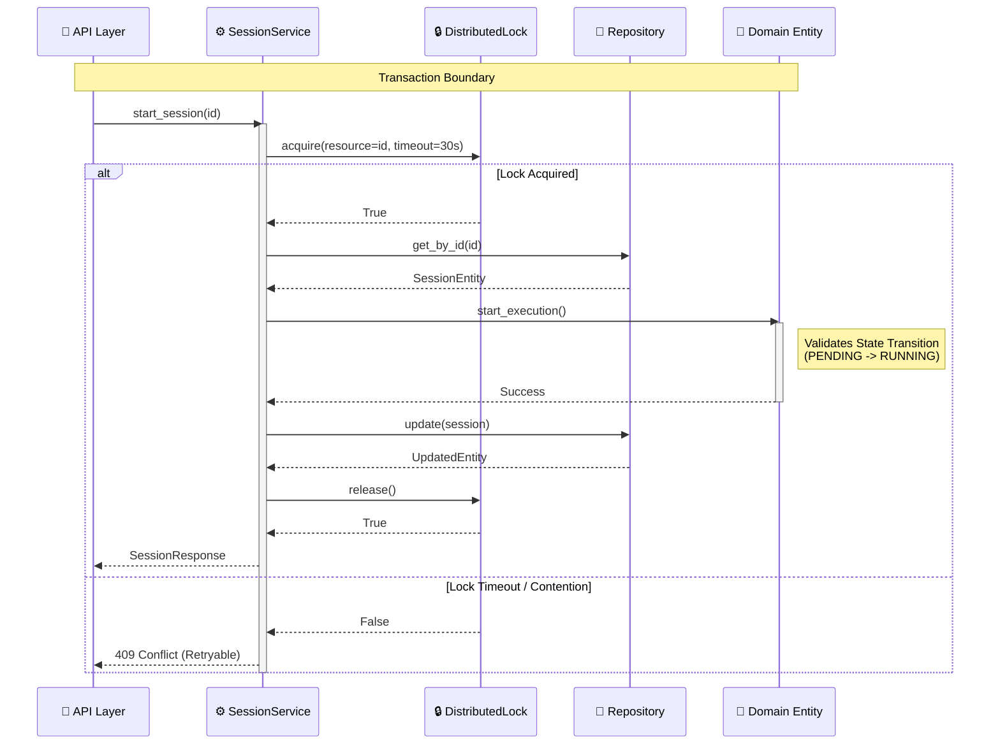
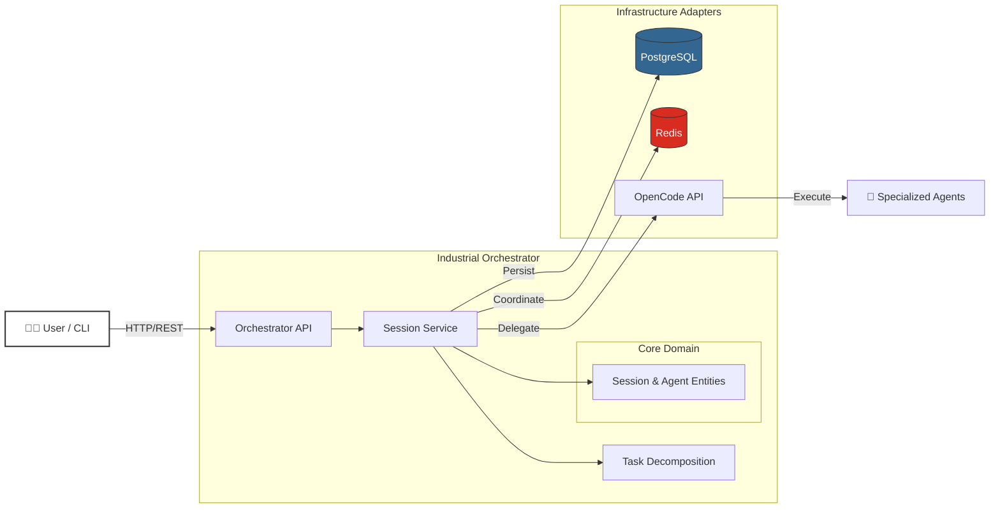

# OpenCode Industrial Orchestrator


> **"Industrial Cybernetics"** — A utilitarian, transparent orchestration interface prioritizing ruthless efficiency, visibility ("Glass Box"), and graceful degradation.

## 📖 Overview

The **OpenCode Industrial Orchestrator** is a robust, production-grade system designed to manage, monitor, and orchestrate autonomous coding sessions. Unlike generic agent frameworks, this system is built on **Hexagonal Architecture (Ports & Adapters)** principles to ensure strict domain isolation, high testability, and infrastructure resilience.

It serves as the central nervous system for autonomous development, handling:
*   **Session Lifecycle Management** with rigid state machine validation.
*   **Multi-Agent Coordination** using capability-based routing.
*   **Task Decomposition** via advanced heuristics and templates.
*   **Distributed Concurrency** with fair locking and deadlock prevention.

## 🏗️ Architecture

The system follows a strict **Hexagonal Architecture**, separating the core business logic from the outside world.

### Application Logic Flow

The following diagram illustrates the resilient flow of a session start operation, highlighting the interaction between the Application Service, Distributed Locking mechanism, and Domain Layer.



### System Interaction

High-level view of how users and agents interact with the Orchestrator.



## 📂 File Hierarchy

A curated view of the project's structure, highlighting the separation of concerns.

```text
opencode-industrial-orchestrator/
├── 📂 orchestrator/                  # Core Python Backend
│   ├── 📂 src/industrial_orchestrator/
│   │   ├── 📂 domain/                # 🧠 PURE BUSINESS LOGIC (No external deps)
│   │   │   ├── 📂 entities/          # Core models (Session, Agent, Task)
│   │   │   │   ├── agent.py          # Agent specialization logic
│   │   │   │   ├── session.py        # Session state machine
│   │   │   │   └── task.py           # Task decomposition & DAG
│   │   │   ├── 📂 value_objects/     # Immutable domain values (Status, Metrics)
│   │   │   ├── 📂 events/            # Domain events (SessionCreated, etc.)
│   │   │   └── 📂 exceptions/        # Domain-specific errors
│   │   │
│   │   ├── 📂 application/           # ⚙️ ORCHESTRATION LOGIC
│   │   │   ├── 📂 services/          # Business use cases
│   │   │   │   ├── session_service.py # Lifecycle management
│   │   │   │   └── task_decomposition_service.py
│   │   │   └── 📂 ports/             # Interfaces for infrastructure
│   │   │
│   │   ├── 📂 infrastructure/        # 🔌 ADAPTERS & IO
│   │   │   ├── 📂 database/          # SQLAlchemy Models & Config
│   │   │   ├── 📂 repositories/      # Data access implementations
│   │   │   │   └── session_repository.py
│   │   │   ├── 📂 locking/           # Distributed locking (Redis)
│   │   │   │   └── distributed_lock.py
│   │   │   ├── 📂 adapters/          # External API clients
│   │   │   │   └── opencode_client.py
│   │   │   └── 📂 config/            # Env vars & connections
│   │   │
│   │   └── 📂 presentation/          # 🖥️ ENTRY POINTS
│   │       └── 📂 api/               # FastAPI routes
│   │
│   ├── 📂 tests/                     # 🧪 COMPREHENSIVE TEST SUITE
│   │   ├── 📂 unit/                  # Fast domain tests
│   │   └── 📂 integration/           # DB/Redis integration tests
│   │
│   └── 📂 alembic/                   # Database Migrations
│
├── 📂 infrastructure/                # 🏗️ OPS CONFIGURATION
│   └── 📂 monitoring/                # Prometheus/Grafana configs
├── docker-compose.yml                # Main service definition
└── GEMINI.md                         # Context documentation
```

## ✨ Key Features

*   **Resilient State Management:** PostgreSQL persistence with optimistic locking and soft deletion.
*   **Distributed Coordination:** Redis-based fair locking queues with deadlock detection and auto-renewal.
*   **Multi-Agent Intelligence:**
    *   **Specialized Roles:** Architect, Implementer, Reviewer, Debugger.
    *   **Capability Routing:** Matches tasks to agents based on skills and performance tier.
    *   **Performance Tracking:** Real-time metrics on success rates, quality, and cost.
*   **Task Decomposition:**
    *   **Heuristic Analysis:** Estimates complexity based on requirement text.
    *   **Template Support:** Microservice, CRUD, and Security implementation patterns.
    *   **Dependency Management:** DAG validation and critical path calculation.
*   **Glass Box Monitoring:** Comprehensive metrics for every transition and operation.

## 🚀 Deployment & Usage

### Prerequisites
*   Docker & Docker Compose
*   Python 3.11+
*   Poetry

### Quick Start (Local Development)

1.  **Initialize Infrastructure:**
    ```bash
    docker-compose up -d postgres redis opencode-server
    ```

2.  **Install Dependencies:**
    ```bash
    cd orchestrator
    poetry install
    ```

3.  **Run Migrations:**
    ```bash
    poetry run alembic upgrade head
    ```

4.  **Start the Orchestrator:**
    ```bash
    poetry run uvicorn src.industrial_orchestrator.presentation.api.main:app --reload
    ```

### Testing

We strictly adhere to TDD (Test-Driven Development).

```bash
# Run all tests
cd orchestrator
poetry run pytest

# Run only unit tests (fast)
poetry run pytest tests/unit

# Run integration tests (requires Docker infra)
poetry run pytest tests/integration
```

## 🛠️ Configuration

Key environment variables (defined in `.env`):

| Variable | Description | Default |
| :--- | :--- | :--- |
| `DB_HOST` | Database Host | `postgres` |
| `REDIS_HOST` | Redis Host | `redis` |
| `OPENCODE_HOST` | OpenCode API Host | `opencode-server` |
| `MAX_CONCURRENT_SESSIONS` | Parallel execution limit | `25` |
| `SESSION_TIMEOUT_SECONDS` | Hard timeout for sessions | `3600` |

## 📜 License

This project is licensed under the MIT License.
