<p align="center">
  
</p>

<p align="center">
  <strong>"Industrial Cybernetics"</strong> — A utilitarian, transparent orchestration interface<br/>prioritizing ruthless efficiency, visibility, and graceful degradation.
</p>

<p align="center">
  
  
  
  
  
</p>

---

## 🎯 Why This Project?

Modern AI agents can write code, but **who orchestrates the agents?**

The **OpenCode Industrial Orchestrator** is the missing control plane for autonomous development. It provides:

| Challenge | Solution |
|:----------|:---------|
| **Agent Chaos** | Centralized registry with capability-based routing |
| **Lost Context** | Shared execution context with conflict detection |
| **Task Complexity** | Intelligent decomposition using proven templates |
| **Blind Debugging** | "Glass Box" monitoring with real-time WebSocket updates |
| **Vendor Lock-in** | **External Agent Protocol (EAP)** for language-agnostic plugins |
| **Model Stagnation** | **Fine-Tuning Pipeline** for autonomous agent specialization |
| **Team Scaling** | **Multi-Tenant Isolation** with RBAC and resource quotas |
| **Infrastructure Fragility** | Distributed locking, circuit breakers, graceful degradation |

---

## ✨ Key Features

<table>
<tr>
<td width="50%">

### 🧠 Multi-Agent Intelligence
- **Agent Registry** — Dynamic registration and discovery
- **Capability Routing** — Match tasks to specialist agents
- **EAP v1.0** — Connect external agents via JSON/HTTP
- **Fine-Tuning** — Autonomous model specialization pipeline

</td>
<td width="50%">

### 📋 Task Decomposition
- **Heuristic Analysis** — Estimate complexity from requirements
- **Templates** — Microservice, CRUD, Security patterns
- **Dependency DAG** — Topological ordering with cycle detection
- **Critical Path** — Identify bottlenecks automatically

</td>
</tr>
<tr>
<td width="50%">

### 🔒 Industrial Resilience
- **Distributed Locking** — Fair queues with TTL
- **Circuit Breakers** — Fail fast, recover smart
- **Multi-Tenancy** — Strict team isolation & RBAC
- **Quota Control** — Resource limits per organization

</td>
<td width="50%">

### 👁️ Glass Box Monitoring
- **Marketplace UI** — "Control Room" for agent units
- **Model Registry** — Real-time training telemetry
- **Real-time WebSocket** — Subscribe to session events
- **Checkpoint Recovery** — Resume from last known state

</td>
</tr>
</table>

---

## 🏗️ Architecture

The system follows **Hexagonal Architecture** (Ports & Adapters) for maximum testability and domain isolation.

```mermaid
graph LR
    User[👨‍💻 Developer] -->|REST/WS| API[Orchestrator API]
    
    subgraph "Core Domain"
        API --> Services[Services Layer]
        Services --> Entities[Domain Entities]
    end
    
    subgraph "Infrastructure"
        Services -->|Persist| PG[(PostgreSQL)]
        Services -->|Coordinate| Redis[(Redis)]
        Services -->|Delegate| OpenCode[OpenCode API]
        Services -->|EAP| ExtAgents[🌐 External Agents]
        Services -->|Train| GPU[🚀 Compute Provider]
    end
    
    OpenCode --> Agents[🤖 Specialized Agents]
    
    style User fill:#fff,stroke:#333,stroke-width:2px
    style PG fill:#336791,stroke:#333,color:#fff
    style Redis fill:#D82C20,stroke:#333,color:#fff
```



### Layer Responsibilities

| Layer | Purpose | Examples |
|:------|:--------|:---------|
| **Domain** | Pure business logic, no I/O | `SessionEntity`, `FineTuningJob`, `Tenant` |
| **Application** | Orchestration, use cases | `SessionService`, `DatasetCuratorService` |
| **Infrastructure** | External adapters | `EAPAgentAdapter`, `TrainingProviderPort` |
| **Presentation** | Entry points | REST API, WebSocket, Team Selector UI |

---

## 🚀 Quick Start

### Prerequisites
- Docker & Docker Compose
- Python 3.11+
- Poetry (`pip install poetry`)
- Node.js 18.17+ (for dashboard)

### 1. Start Infrastructure
```bash
docker-compose up -d postgres redis opencode-server
```

### 2. Install & Run Backend
```bash
cd orchestrator
poetry install
poetry run alembic upgrade head
poetry run uvicorn src.industrial_orchestrator.presentation.api.main:app --reload
```

### 3. Run Tests
```bash
poetry run pytest  # 337 tests
```

### 4. Start Dashboard (Optional)
```bash
cd dashboard
npm install
npm run dev
```

---

## 📡 API Reference

### REST Endpoints

```
POST   /api/v1/sessions              Create session
GET    /api/v1/sessions              List sessions
POST   /api/v1/sessions/{id}/start   Start execution

POST   /api/v1/agents/external/register Register external agent (EAP)
POST   /api/v1/agents/external/{id}/heartbeat Send agent heartbeat

POST   /api/v1/fine-tuning/jobs      Create training job
POST   /api/v1/fine-tuning/jobs/poll Sync training progress

POST   /api/v1/tasks                 Create task
POST   /api/v1/tasks/{id}/decompose  Decompose into subtasks

POST   /api/v1/contexts              Create context
POST   /api/v1/contexts/merge        Merge contexts
```

### WebSocket Endpoints

```
WS     /ws/sessions                  All session events
WS     /ws/sessions/{id}             Specific session events
```

---

## 📂 Project Structure

```
opencode-industrial-orchestrator/
├── orchestrator/                     # Python Backend
│   ├── src/industrial_orchestrator/
│   │   ├── domain/                   # 🧠 Business Logic
│   │   │   ├── entities/             # Session, Agent, Task, FineTuning, Tenant
│   │   │   ├── value_objects/        # Status, Version, Metrics
│   │   │   └── exceptions/           # Domain errors
│   │   ├── application/              # ⚙️ Services
│   │   │   ├── services/             # Session, FineTuning, Tenant, Curator
│   │   │   ├── ports/                # ExternalAgentPort, TrainingProviderPort
│   │   │   └── dtos/                 # EAP & API DTOs
│   │   ├── infrastructure/           # 🔌 Adapters
│   │   │   ├── repositories/         # PostgreSQL, Redis
│   │   │   ├── locking/              # Distributed locks
│   │   │   └── adapters/             # OpenCode, EAP, Training
│   │   └── presentation/             # 🖥️ Entry Points
│   │       ├── api/                  # FastAPI routers & Middleware
│   │       └── websocket/            # Real-time events
│   ├── tests/                        # 337 unit & integration tests
│   └── alembic/                      # Database migrations
│
├── dashboard/                        # Next.js Frontend
│   └── src/                          # Marketplace & Model Registry UI
│
└── infrastructure/                   # Docker & Monitoring
```

---

## 🧪 Testing

We practice **Test-Driven Development (TDD)** religiously.

| Component | Tests |
|:----------|------:|
| Session Entity | 42 |
| Agent Entity | 54 |
| Task Entity | 53 |
| Context Entity | 39 |
| Fine-Tuning & Tenant | 15 |
| Integration & Infrastructure | ~134 |
| **Total** | **337** |

```bash
# Run all tests
poetry run pytest

# Run with coverage
poetry run pytest --cov=src

# Run specific test file
poetry run pytest tests/unit/domain/test_session_entity.py
```

---

## 🤝 Contributing

We welcome contributions! Please follow these guidelines:

1. **TDD is mandatory** — Write tests before implementation
2. **Hexagonal imports** — Domain never imports from Infrastructure
3. **Tenant context** — Always include X-Tenant-ID header in API tests
4. **Code style** — Run `black`, `isort`, and `flake8`

---

## 📋 Roadmap

- [x] **Phase 2.1** — Foundation & Core Orchestrator
- [x] **Phase 2.2** — Multi-Agent Intelligence (212 tests ✅)
- [x] **Phase 2.3** — Dashboard & Visualization ("Glass Box" Interface ✅)
- [x] **Phase 2.4** — Production Hardening (Kubernetes, CI/CD, Observability ✅)
- [x] **Phase 3.1** — Agent Marketplace (EAP Integration ✅)
- [x] **Phase 3.2** — LLM Fine-tuning Pipeline (✅ Complete)
- [x] **Phase 3.3** — Multi-Tenant Isolation (✅ Complete)

---

## 📜 License

MIT License — See [LICENSE](LICENSE) for details.

---

<p align="center">
  <sub>Built with 🔧 industrial-grade precision</sub>
</p>
