# User Guide — OpenCode Industrial Orchestrator

> **"Industrial Cybernetics"** — A manual for the operation, monitoring, and control of the OpenCode Orchestration System.

---

## 1. Introduction

The **OpenCode Industrial Orchestrator** is a production-grade control plane for autonomous AI coding agents. Unlike chat-based interfaces or fragile scripts, this system treats code generation as an **industrial process**:

*   **Deterministic:** Defined states (`PENDING` → `RUNNING` → `COMPLETED`).
*   **Resilient:** Distributed locking and automatic checkpointing.
*   **Observable:** A "Glass Box" dashboard providing real-time telemetry into agent thought processes.

### System Architecture

The system operates as a central hub connecting specialized agents, shared memory, and external tools.

```mermaid
graph TD
    User[👨‍💻 User] -->|Commands| Dashboard[🖥️ Dashboard]
    Dashboard -->|API| Orchestrator[⚙️ Orchestrator Core]
    
    subgraph "Industrial Cluster"
        Orchestrator -->|Manage| Session[Session State Machine]
        Orchestrator -->|Route| Agents[🤖 Agent Registry]
        Orchestrator -->|Store| Context[🧠 Shared Context]
    end
    
    Agents -->|Execute| OpenCode[OpenCode API]
    Session -->|Persist| DB[(PostgreSQL)]
    Session -->|Lock| Redis[(Redis)]
```



---

## 2. Quick Start

### Prerequisites
*   **Docker** & **Docker Compose** (Recommended)
*   *Alternatively:* Python 3.11+, Node.js 18+, PostgreSQL 15, Redis 7

### Installation & Startup

The fastest way to spin up the entire stack (Orchestrator, Dashboard, Database, Cache) is via Docker Compose.

```bash
# 1. Clone the repository
git clone https://github.com/your-org/opencode-industrial-orchestrator.git
cd opencode-industrial-orchestrator

# 2. Start the infrastructure
docker-compose up -d

# 3. Access the interfaces
# Dashboard: http://localhost:3000
# API Docs:  http://localhost:8000/docs
```

---

## 3. The "Glass Box" Dashboard

The Dashboard is your primary interface for command and control. It utilizes a **Brutalist / Industrial** aesthetic designed for high information density and low cognitive load.

### A. System Overview (`/`)
The landing page provides a high-level situational report (SITREP) of the orchestration cluster.
*   **Session Metrics:** Real-time counters for Running, Pending, Completed, and Failed sessions.
*   **Agent Status:** Gauge showing total vs. active agents to identify capacity bottlenecks.
*   **Recent Activity:** A quick-access log of the latest session state changes.

### B. Session Management (`/sessions`)
The central command list for all coding tasks.
*   **Filtering:** Use the status chips (`RUNNING`, `FAILED`, etc.) to filter the view.
*   **Pagination:** Navigate through historical session data.
*   **Creation:** Click **+ NEW SESSION** to dispatch a new coding task. You will provide:
    *   **Title:** A human-readable identifier (e.g., "Refactor Auth Middleware").
    *   **Initial Prompt:** The high-level instruction for the Architect Agent.
    *   **Priority:** `LOW` to `CRITICAL`.

### C. The Session Detail View (`/sessions/[id]`)
This is the core "Glass Box" interface. It provides total transparency into a running session.


| Component | Function |
|:----------|:---------|
| **Header Controls** | **Start**, **Stop**, and **Retry** buttons. Status badges update in real-time. |
| **Live Terminal** | A raw, scrolling feed of agent logs, internal monologues, and tool outputs via WebSocket. |
| **Telemetry** | Live gauges for **Tokens Used**, **Success Rate**, and **Duration**. |
| **Checkpoint Timeline** | A vertical history of state saves. Shows exactly when and why the system saved its state (e.g., "After Tool Use", "Periodic"). |

### D. Agent Fleet (`/agents`)
Monitor the workforce.
*   **Load Gauges:** Visual representation of each agent's current load (0-100%).
*   **Performance Tiers:** Agents are classified as `ELITE`, `STANDARD`, or `PROBATION` based on their success rates.
*   **Capabilities:** View which agents handle `CODE_GENERATION` vs. `SECURITY_AUDIT`.

### E. Task Decomposition (`/tasks`)
Visualize the work breakdown structure.
*   **Task Tree:** Recursive visualization of how the Orchestrator broke down a high-level prompt into atomic subtasks.
*   **Status Tracking:** See which specific subtask is blocking progress.

---

## 4. Operational Concepts

### Session Lifecycle
A **Session** is the fundamental unit of work. It moves through a rigid state machine to ensure deterministic execution.


### Agents & Routing
**Agents** are specialized workers. The system uses a **Capability-Based Routing** algorithm.
1.  **Task Analysis:** The system identifies required capabilities (e.g., `PYTHON`, `SECURITY_AUDIT`).
2.  **Discovery:** It queries the **Agent Registry** for matching agents.
3.  **Selection:** It selects the best agent based on **Availability** (lowest load) and **Performance Tier**.

### Context & Memory
**Context** is the shared memory layer.
*   **Scopes:** Data can be scoped to a `SESSION` (all agents in session), a `TASK` (local scratchpad), or `GLOBAL` (cross-session knowledge).
*   **Conflict Resolution:** The system automatically handles merging data when multiple agents update context simultaneously using version vectors.

---

## 5. API Interaction

For automated workflows or CI/CD integration, use the REST API.

**Base URL:** `http://localhost:8000/api/v1`

### Key Endpoints

*   **Create Session:** `POST /sessions`
*   **Start Session:** `POST /sessions/{id}/start`
*   **Get Session Status:** `GET /sessions/{id}`
*   **Register Agent:** `POST /agents`

Full Swagger documentation is available at `http://localhost:8000/docs`.

---

## 6. Observability & Monitoring

For production environments, we expose industry-standard metrics accessible via Grafana.

### Prometheus Metrics
The API exposes a `/metrics` endpoint for scraping.

| Metric | Type | Description |
|:-------|:-----|:------------|
| `orchestrator_active_sessions` | Gauge | Number of currently running sessions |
| `orchestrator_tasks_total` | Counter | Total tasks processed (success/fail) |
| `http_request_duration_seconds` | Histogram | API latency distribution |
| `orchestrator_agent_load` | Gauge | Current load factor per agent |

### Logging
All logs are emitted in **Structured JSON** format to stdout, making them ready for ingestion by log aggregators (Elasticsearch, Datadog, Splunk).

```json
{
  "timestamp": "2024-02-03T12:00:00Z",
  "level": "info",
  "event": "session_started",
  "session_id": "1234-5678",
  "logger": "industrial_orchestrator.services.session"
}
```

---

## 7. Troubleshooting

**Issue: Dashboard shows "Uplink Failed"**
*   **Check:** Is the backend API running? (`docker ps`)
*   **Check:** Are you on the same network? The dashboard attempts to connect to `ws://localhost:8000`.

**Issue: Session stuck in `PENDING`**
*   **Check:** Did you click "Start Execution"? Sessions are created in a paused state by default.
*   **Check:** Are there available agents with the required capabilities?

**Issue: Agents not appearing**
*   **Check:** Verify Redis connection. The Agent Registry relies on Redis for discovery.