# User Guide — OpenCode Industrial Orchestrator

> **"Industrial Cybernetics"** — A manual for the operation, monitoring, and control of the OpenCode Orchestration System.

---

## 1. Introduction

The **OpenCode Industrial Orchestrator** is a production-grade control plane for autonomous AI coding agents. Unlike chat-based interfaces or fragile scripts, this system treats code generation as an **industrial process**:

*   **Deterministic:** Defined states (`PENDING` → `RUNNING` → `COMPLETED`).
*   **Resilient:** Distributed locking and automatic checkpointing.
*   **Observable:** A "Glass Box" dashboard providing real-time telemetry into agent thought processes.

### System Architecture

The system operates as a central hub connecting specialized agents, shared memory, and external tools.

```mermaid
graph TD
    User[👨‍💻 User] -->|Commands| Dashboard[🖥️ Dashboard]
    Dashboard -->|API| Orchestrator[⚙️ Orchestrator Core]
    
    subgraph "Industrial Cluster"
        Orchestrator -->|Manage| Session[Session State Machine]
        Orchestrator -->|Route| Agents[🤖 Agent Registry]
        Orchestrator -->|Store| Context[🧠 Shared Context]
    end
    
    Agents -->|Execute| OpenCode[OpenCode API]
    Session -->|Persist| DB[(PostgreSQL)]
    Session -->|Lock| Redis[(Redis)]
```



---

## 2. Quick Start

### Prerequisites
*   **Docker** & **Docker Compose** (Recommended)
*   *Alternatively:* Python 3.11+, Node.js 18+, PostgreSQL 15, Redis 7

### Installation & Startup

The fastest way to spin up the entire stack (Orchestrator, Dashboard, Database, Cache) is via Docker Compose.

```bash
# 1. Clone the repository
git clone https://github.com/your-org/opencode-industrial-orchestrator.git
cd opencode-industrial-orchestrator

# 2. Start the infrastructure
docker-compose up -d

# 3. Access the interfaces
# Dashboard: http://localhost:3000
# API Docs:  http://localhost:8000/docs
```

---

## 3. The "Glass Box" Dashboard

The Dashboard is your primary interface for command and control. It utilizes a **Brutalist / Industrial** aesthetic designed for high information density and low cognitive load.

### A. System Overview (`/`)
The landing page provides a high-level situational report (SITREP) of the orchestration cluster.
*   **Session Metrics:** Real-time counters for Running, Pending, Completed, and Failed sessions.
*   **Agent Status:** Gauge showing total vs. active agents to identify capacity bottlenecks.
*   **Recent Activity:** A quick-access log of the latest session state changes.

### B. Session Management (`/sessions`)
The central command list for all coding tasks.
*   **Filtering:** Use the status chips (`RUNNING`, `FAILED`, etc.) to filter the view.
*   **Pagination:** Navigate through historical session data.
*   **Creation:** Click **+ NEW SESSION** to dispatch a new coding task. You will provide:
    *   **Title:** A human-readable identifier (e.g., "Refactor Auth Middleware").
    *   **Initial Prompt:** The high-level instruction for the Architect Agent.
    *   **Priority:** `LOW` to `CRITICAL`.

### C. The Session Detail View (`/sessions/[id]`)
This is the core "Glass Box" interface. It provides total transparency into a running session.


| Component | Function |
|:----------|:---------|
| **Header Controls** | **Start**, **Stop**, and **Retry** buttons. Status badges update in real-time. |
| **Live Terminal** | A raw, scrolling feed of agent logs, internal monologues, and tool outputs via WebSocket. |
| **Telemetry** | Live gauges for **Tokens Used**, **Success Rate**, and **Duration**. |
| **Checkpoint Timeline** | A vertical history of state saves. Shows exactly when and why the system saved its state (e.g., "After Tool Use", "Periodic"). |

### D. Agent Fleet (`/agents`) — *Coming Soon*
> **Status:** 🚧 This feature is planned for a future release (Phase 3.x).

Monitor the workforce.
*   **Load Gauges:** Visual representation of each agent's current load (0-100%).
*   **Performance Tiers:** Agents are classified as `ELITE`, `ADVANCED`, `COMPETENT`, `TRAINEE`, or `DEGRADED` based on their success rates.
*   **Capabilities:** View which agents handle `CODE_GENERATION` vs. `SECURITY_AUDIT`.

*The Agent Registry backend is fully implemented. The dashboard visualization will be available in an upcoming release.*

### E. Task Decomposition (`/tasks`) — *Coming Soon*
> **Status:** 🚧 This feature is planned for a future release (Phase 3.x).

Visualize the work breakdown structure.
*   **Task Tree:** Recursive visualization of how the Orchestrator broke down a high-level prompt into atomic subtasks.
*   **Status Tracking:** See which specific subtask is blocking progress.
*   **Dependency Graph:** Visual representation of task dependencies and critical path.

*The Task Decomposition Service backend is fully implemented with support for Microservice, CRUD, Security, and UI templates. The dashboard visualization will be available in an upcoming release.*

---

## 4. Operational Concepts

### Session Lifecycle
A **Session** is the fundamental unit of work. It moves through a rigid state machine to ensure deterministic execution.

> **Note:** The diagram below shows a simplified view of the session lifecycle. The actual system implements 12 distinct states (see Architecture Deep Dive in Section 5).


### Agents & Routing
**Agents** are specialized workers. The system uses a **Capability-Based Routing** algorithm.
1.  **Task Analysis:** The system identifies required capabilities (e.g., `PYTHON`, `SECURITY_AUDIT`).
2.  **Discovery:** It queries the **Agent Registry** for matching agents.
3.  **Selection:** It selects the best agent based on **Availability** (lowest load) and **Performance Tier**.

### Context & Memory
**Context** is the shared memory layer.
*   **Scopes:** Data can be scoped to a `SESSION` (all agents in session), a `TASK` (local scratchpad), or `GLOBAL` (cross-session knowledge).
*   **Conflict Resolution:** The system automatically handles merging data when multiple agents update context simultaneously using version vectors.

---

## 5. Architecture Deep Dive

### The 12-State Session State Machine

The Industrial Orchestrator implements a **rigorous 12-state model** for session lifecycle management. Each state transition is validated to prevent illegal state changes.

#### State Categories

| Category | States | Description |
|:---------|:-------|:------------|
| **Initial** | `PENDING` | Session created, awaiting execution |
| **Active** | `QUEUED`, `RUNNING`, `PAUSED`, `DEGRADED` | Session is being processed or can be resumed |
| **Success** | `COMPLETED`, `PARTIALLY_COMPLETED` | Session finished successfully (full or partial) |
| **Failure** | `FAILED`, `TIMEOUT`, `STOPPED`, `CANCELLED` | Session terminated due to error or intervention |
| **System** | `ORPHANED` | Session lost parent/child relationship |

#### Complete State Reference

| State | Emoji | Color Code | Terminal | Description |
|:------|:-----:|:----------:|:--------:|:------------|
| `PENDING` | ⏳ | #6B7280 | No | Created, awaiting execution |
| `QUEUED` | 📋 | #3B82F6 | No | In execution queue |
| `RUNNING` | ⚙️ | #10B981 | No | Actively executing |
| `PAUSED` | ⏸️ | #F59E0B | No | Manually paused |
| `COMPLETED` | ✅ | #059669 | **Yes** | Successfully finished |
| `PARTIALLY_COMPLETED` | ⚠️ | #D97706 | **Yes** | Some sub-tasks succeeded |
| `FAILED` | ❌ | #DC2626 | **Yes** | Execution failed |
| `TIMEOUT` | ⏰ | #7C3AED | **Yes** | Exceeded max duration |
| `STOPPED` | 🛑 | #4B5563 | **Yes** | Manually stopped |
| `CANCELLED` | 🚫 | #374151 | **Yes** | Cancelled before/during execution |
| `ORPHANED` | 🧩 | #9333EA | **Yes** | Lost parent/child relationship |
| `DEGRADED` | 🔻 | #F97316 | No | Running with reduced capacity |

#### Valid Transitions

```
PENDING → QUEUED, RUNNING, CANCELLED, FAILED
QUEUED  → RUNNING, CANCELLED, FAILED
RUNNING → COMPLETED, PARTIALLY_COMPLETED, FAILED, TIMEOUT, PAUSED, STOPPED, DEGRADED
PAUSED  → RUNNING, STOPPED, CANCELLED
DEGRADED → RUNNING, FAILED, COMPLETED, STOPPED
PARTIALLY_COMPLETED → RUNNING, COMPLETED
```

> **Industrial Design Principle:** Once a session reaches a terminal state (COMPLETED, FAILED, TIMEOUT, STOPPED, CANCELLED, ORPHANED), no further transitions are permitted. This ensures audit integrity and prevents accidental state corruption.

### Checkpoint System

Sessions support **automatic and manual checkpointing** for fault tolerance:

*   **Automatic Checkpoints:** Created periodically and after significant operations
*   **Manual Checkpoints:** Triggered via API for critical milestones
*   **Recovery:** Failed sessions with checkpoints can be retried from the last known good state
*   **Rotation:** Only the 100 most recent checkpoints are retained per session

### Agent Performance Tiers

Agents are automatically classified based on historical performance:

| Tier | Success Rate | Description |
|:-----|:-------------|:------------|
| `ELITE` | > 95% | Exceptional quality, exceptional reliability |
| `ADVANCED` | 85-95% | High quality, reliable |
| `COMPETENT` | 70-85% | Reliable for standard tasks |
| `TRAINEE` | 50-70% | Learning, requires supervision |
| `DEGRADED` | < 50% | Performance issues detected, tasks rerouted |

### Context Scopes

The Context system supports four visibility scopes:

| Scope | Visibility | Use Case |
|:------|:-----------|:---------|
| `GLOBAL` | All sessions | Cross-session knowledge, patterns |
| `SESSION` | Single session | Shared state for all agents in a session |
| `AGENT` | Single agent | Agent-specific memory and preferences |
| `TEMPORARY` | Single task | Scratch space, auto-cleanup after task |

#### Conflict Resolution

When multiple agents update context simultaneously:

1. **Optimistic Locking:** Each context has a version number
2. **Last-Write-Wins:** Default strategy for non-critical data
3. **Deep Merge:** For nested objects, merges rather than replaces
4. **Manual Resolution:** For critical conflicts, requires operator intervention

---

## 6. External Agent Protocol (EAP)

> **Status:** 🚧 Phase 3.1 — Partially Implemented

The **External Agent Protocol (EAP)** enables agents running outside the orchestrator's process boundary (microservices, Lambda functions, sidecars) to register and communicate with the system.

### Protocol Overview

EAP uses **JSON-over-HTTP** for communication with the following design principles:

1. **Agent-Initiated Registration:** Agents "phone home" to register
2. **Pull-Based Tasking:** Agents request work or receive events via WebSocket
3. **Schema Enforcement:** Strict Pydantic/JSON Schema validation
4. **Stateless Interaction:** Orchestrator holds state; agent is execution unit

### Registration (`POST /api/v1/agents/external/register`)

External agents must register before receiving tasks:

```json
{
  "protocol_version": "1.0",
  "name": "AGENT-EXT-PYTHON-01",
  "version": "1.2.0",
  "agent_type": "implementer",
  "capabilities": ["code_generation", "python_expert"],
  "endpoint_url": "http://agent-service:8080",
  "metadata": {
    "maintainer": "DevOps Team",
    "runtime": "python:3.11"
  }
}
```

**Response:**
```json
{
  "agent_id": "550e8400-e29b-41d4-a716-446655440000",
  "status": "registered",
  "auth_token": "eyJhbGciOiJIUzI1NiIsInR5cCI6IkpXVCJ9...",
  "heartbeat_interval_seconds": 30
}
```

### Heartbeat (`POST /api/v1/agents/external/{id}/heartbeat`)

Agents must send periodic heartbeats to maintain liveness:

```json
{
  "status": "healthy",
  "current_load": 0.5,
  "tasks_in_progress": 2,
  "metrics": {
    "memory_usage_mb": 128,
    "uptime_seconds": 3600
  },
  "timestamp": "2024-02-03T12:00:00Z"
}
```

**Status Values:**
*   `healthy` — Operating normally
*   `degraded` — Operating with reduced capacity
*   `busy` — At capacity, not accepting new tasks
*   `offline` — Scheduled maintenance or shutdown

### Task Assignment (Orchestrator → Agent)

When a task is routed to an external agent:

```json
{
  "task_id": "550e8400-e29b-41d4-a716-446655440001",
  "session_id": "550e8400-e29b-41d4-a716-446655440002",
  "task_type": "code_generation",
  "context": {
    "project": "microservice-auth",
    "language": "python"
  },
  "input_data": "Write a FastAPI router for JWT authentication...",
  "requirements": ["fastapi", "pydantic", "python-jose"],
  "timeout_seconds": 3600
}
```

### Task Result (Agent → Orchestrator)

Upon completion, agents submit results:

```json
{
  "task_id": "550e8400-e29b-41d4-a716-446655440001",
  "status": "completed",
  "artifacts": [
    {
      "path": "auth_router.py",
      "content": "from fastapi import APIRouter...",
      "mime_type": "text/x-python"
    }
  ],
  "output_data": {
    "files_created": ["auth_router.py", "models.py"],
    "tests_passed": true
  },
  "execution_time_ms": 1500,
  "tokens_used": 450,
  "cost_usd": 0.023
}
```

### Authentication

All EAP requests must include the authentication token in the header:

```
Authorization: Bearer <auth_token>
X-Agent-ID: <agent_id>
```

---

## 7. API Interaction

For automated workflows or CI/CD integration, use the REST API.

**Base URL:** `http://localhost:8000/api/v1`

### Key Endpoints

#### Session Management

| Method | Endpoint | Description |
|:-------|:---------|:------------|
| `POST` | `/sessions` | Create new session |
| `GET` | `/sessions` | List sessions (paginated) |
| `GET` | `/sessions/{id}` | Get session details |
| `POST` | `/sessions/{id}/start` | Start session execution |
| `POST` | `/sessions/{id}/pause` | Pause running session |
| `POST` | `/sessions/{id}/resume` | Resume paused session |
| `POST` | `/sessions/{id}/complete` | Mark session complete |
| `POST` | `/sessions/{id}/fail` | Mark session failed |
| `POST` | `/sessions/{id}/cancel` | Cancel session |
| `POST` | `/sessions/{id}/checkpoints` | Create checkpoint |
| `GET` | `/sessions/stats` | Get aggregate statistics |

#### Agent Management

| Method | Endpoint | Description |
|:-------|:---------|:------------|
| `POST` | `/agents/register` | Register new agent |
| `POST` | `/agents/{id}/deregister` | Remove agent |
| `GET` | `/agents` | List registered agents |
| `GET` | `/agents/{id}` | Get agent details |
| `POST` | `/agents/route` | Route task to optimal agent |
| `POST` | `/agents/{id}/heartbeat` | Record agent heartbeat |
| `GET` | `/agents/stats` | Get agent statistics |

#### Context Management

| Method | Endpoint | Description |
|:-------|:---------|:------------|
| `POST` | `/contexts` | Create context |
| `GET` | `/contexts/{id}` | Get context |
| `PATCH` | `/contexts/{id}` | Update context |
| `POST` | `/contexts/merge` | Merge multiple contexts |

#### Task Management

| Method | Endpoint | Description |
|:-------|:---------|:------------|
| `POST` | `/tasks` | Create task |
| `GET` | `/tasks/{id}` | Get task details |
| `POST` | `/tasks/{id}/decompose` | Decompose into subtasks |
| `GET` | `/tasks/{id}/dependencies` | Get dependency graph |

### WebSocket Endpoints

| Endpoint | Description |
|:---------|:------------|
| `/ws` | General event stream |
| `/ws/sessions` | All session events |
| `/ws/sessions/{id}` | Specific session events |

Full Swagger documentation is available at `http://localhost:8000/docs`.

---

## 8. Configuration

### Environment Variables

The Industrial Orchestrator is configured via environment variables. Create a `.env` file in the project root or set variables directly.

#### Database Configuration

| Variable | Description | Default |
|:---------|:------------|:--------|
| `DB_HOST` | PostgreSQL hostname | `postgres` |
| `DB_PORT` | PostgreSQL port | `5432` |
| `DB_NAME` | Database name | `orchestration` |
| `DB_USER` | Database username | `cybernetics` |
| `DB_PASSWORD` | Database password | `secure_password` |

#### Redis Configuration

| Variable | Description | Default |
|:---------|:------------|:--------|
| `REDIS_HOST` | Redis hostname | `redis` |
| `REDIS_PORT` | Redis port | `6379` |
| `REDIS_PASSWORD` | Redis password (optional) | — |
| `REDIS_DB` | Redis database number | `0` |

#### OpenCode Integration

| Variable | Description | Default |
|:---------|:------------|:--------|
| `OPENCODE_HOST` | OpenCode API hostname | `opencode-server` |
| `OPENCODE_PORT` | OpenCode API port | `4096` |
| `OPENCODE_PASSWORD` | OpenCode server password | `industrial_secure` |

#### Application Settings

| Variable | Description | Default |
|:---------|:------------|:--------|
| `APP_NAME` | Application name | `Industrial Orchestrator` |
| `APP_VERSION` | Application version | `1.0.0` |
| `APP_ENV` | Environment (`development`, `production`) | `development` |
| `LOG_LEVEL` | Logging level (`DEBUG`, `INFO`, `WARNING`, `ERROR`) | `INFO` |
| `DEBUG` | Enable debug mode | `false` |

#### Session Limits

| Variable | Description | Default |
|:---------|:------------|:--------|
| `MAX_CONCURRENT_SESSIONS` | Maximum parallel sessions | `25` |
| `SESSION_TIMEOUT_SECONDS` | Hard timeout per session | `3600` |
| `DEFAULT_SESSION_PRIORITY` | Default priority for new sessions | `MEDIUM` |

#### Security

| Variable | Description | Default |
|:---------|:------------|:--------|
| `SECRET_KEY` | JWT signing key | Generate random |
| `ACCESS_TOKEN_EXPIRE_MINUTES` | Token expiration | `30` |
| `ALLOWED_HOSTS` | CORS allowed origins | `*` |

### Example `.env` File

```bash
# Database
DB_HOST=localhost
DB_PORT=5432
DB_NAME=orchestration
DB_USER=cybernetics
DB_PASSWORD=your_secure_password

# Redis
REDIS_HOST=localhost
REDIS_PORT=6379

# OpenCode
OPENCODE_HOST=localhost
OPENCODE_PORT=4096
OPENCODE_PASSWORD=your_opencode_password

# Application
APP_ENV=production
LOG_LEVEL=INFO
DEBUG=false

# Limits
MAX_CONCURRENT_SESSIONS=50
SESSION_TIMEOUT_SECONDS=7200
```

---

## 9. Observability & Monitoring

For production environments, we expose industry-standard metrics accessible via Grafana.

### Prometheus Metrics
The API exposes a `/metrics` endpoint for scraping.

| Metric | Type | Description |
|:-------|:-----|:------------|
| `orchestrator_active_sessions` | Gauge | Number of currently running sessions |
| `orchestrator_tasks_total` | Counter | Total tasks processed (success/fail) |
| `http_request_duration_seconds` | Histogram | API latency distribution |
| `orchestrator_active_agents` | Gauge | Number of currently active agents |

### Logging
All logs are emitted in **Structured JSON** format to stdout, making them ready for ingestion by log aggregators (Elasticsearch, Datadog, Splunk).

```json
{
  "timestamp": "2024-02-03T12:00:00Z",
  "level": "info",
  "event": "session_started",
  "session_id": "1234-5678",
  "logger": "industrial_orchestrator.services.session"
}
```

---

## 10. Troubleshooting

**Issue: Dashboard shows "Uplink Failed"**
*   **Check:** Is the backend API running? (`docker ps` or `docker-compose ps`)
*   **Check:** Are you on the same network? The dashboard attempts to connect to `ws://localhost:8000`.
*   **Check:** Verify the `NEXT_PUBLIC_API_URL` and `NEXT_PUBLIC_WS_URL` environment variables in the dashboard container match your orchestrator URL.

**Issue: Session stuck in `PENDING`**
*   **Check:** Did you click "Start Execution"? Sessions are created in a paused state by default.
*   **Check:** Are there available agents with the required capabilities?
*   **Note:** The backend service layer supports automatic session retry, but this feature is not yet exposed in the dashboard UI. You can trigger retry via the API: `POST /api/v1/sessions/{id}/start`.

**Issue: Agents not appearing**
*   **Check:** Verify Redis connection. The Agent Registry relies on Redis for discovery.
*   **Check:** Ensure agents have sent their initial heartbeat after registration.
*   **Note:** The Agent Fleet dashboard page (`/agents`) is not yet implemented. Use the API `GET /api/v1/agents` to list registered agents.